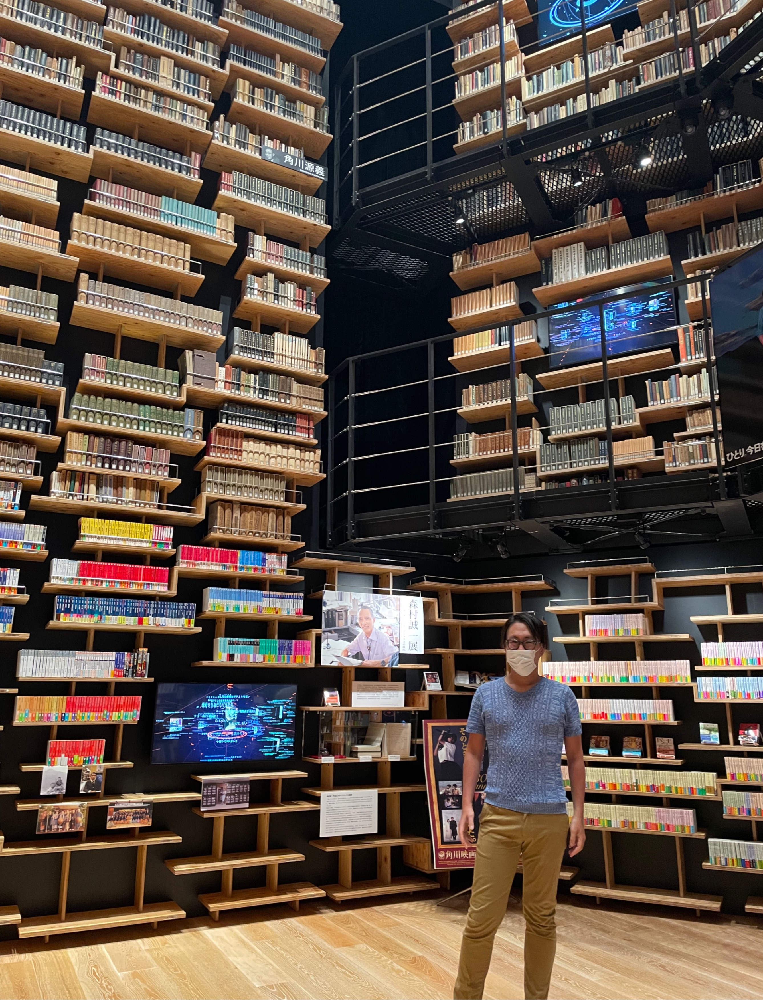

# 職務経歴書（スキルシート）

## 基本情報

<table class="main_table">
    <thead>
        <tr>
            <th align="center" width="10%">項目</th>
            <th align="center" width="50%">詳細</th>
            <th align="center" width="40%">近影</th>
        </tr>
    </thead>
    <tbody>
        <tr>
            <td align="left" width="10%">Name</td>
            <td align="left" width="50%"> Akira Iwasaki </td>
            <td rowspan=6 > &nbsp;&nbsp;&nbsp;&nbsp;&nbsp;&nbsp;&nbsp;&nbsp;&nbsp;&nbsp;&nbsp;&nbsp;&nbsp;&nbsp;&nbsp;&nbsp;&nbsp;&nbsp;&nbsp;&nbsp;&nbsp;&nbsp;&nbsp;&nbsp;&nbsp;&nbsp;&nbsp;&nbsp;&nbsp;&nbsp;&nbsp;&nbsp;&nbsp;&nbsp;&nbsp;&nbsp;&nbsp;&nbsp;&nbsp;&nbsp;&nbsp;&nbsp;&nbsp;&nbsp;&nbsp;&nbsp;&nbsp;</td>
        </tr>
        <tr>
            <td align="left" >Location</td>
            <td align="left"> 神奈川県川崎市  </td>
        </tr>
        <tr>
            <td align="left"> Education</td>
            <td align="left">Nagoya University</td>
        </tr>
        <tr>
            <td align="left">Company</td>
            <td align="left"><a href="https://datamarket.co.jp">株式会社DataMarket</td>
        </tr>
        <tr>
            <td align="left">Qualification</td>
            <td align="left">情報セキュリティスペシャリスト 基本情報処理技術者 等</td>
        </tr>
        <tr>
            <td align="left">Media</td>
            <td align="left"><a href="https://forkwell.connpass.com/event/189259">Data Engineering Study #4 「データ分析基盤の障害対応事例LT祭り」等</td>
        </tr>
    </tbody>
</table>

## Article・SNS

<table class="main_table">
    <thead>
        <tr>
            <th align="center" width="30%">項目</th>
            <th align="center" width="70%">詳細</th>
        </tr>
    </thead>
    <tbody>
        <tr>
            <td align="left"> Twitter</td>
            <td align="left"> <a href="https://twitter.com/sista05"> Twitter
             <a href="https://twitter.com/d8amkt"> (DataMarket公式Twitter)
            </td>
        </tr>
        <tr>
            <td align="left"> LinkedIn</td>
            <td align="left"><a href="https://www.linkedin.com/in/datamarket"> https://www.linkedin.com/in/datamarket</td>
        </tr>
        <tr>
            <td align="left"> Qiita</td>
            <td align="left"> <a href="https://qiita.com/sista05"> https://qiita.com/sista05</td>
        </tr>
        <tr>
            <td align="left"> Zenn</td>
            <td align="left"> <a href="https://zenn.dev/datamarket"> https://zenn.dev/datamarket</td>
        </tr>
        <tr>
            <td align="left"> Note</td>
            <td align="left"><a href="https://note.com/datamarket"> https://note.com/datamarket</td>
        </tr>
        <tr>
            <td align="left"> Medium</td>
            <td align="left"><a href="https://medium.com/@akisista05"> https://medium.com/@akisista05</td>
        </tr>
        <tr>
            <td align="left"> YouTrust</td>
            <td align="left"><a href="https://youtrust.jp/users/datamarket"> https://youtrust.jp/users/datamarket</td>
        </tr>
        <tr>
            <td align="left"> Facebook</td>
            <td align="left"> <a href="https://facebook.com/akisista05">Akira Iwasaki</td>
        </tr>
    </tbody>
</table>

## Contents

- [自己紹介](#自己紹介)
- [スキル](#スキル)
- [現在継続中の開発案件](#現在継続中の開発案件)
  - [ECサイトのCRM環境(Salesforce CDP・MC)構築](#ecサイトのcrm環境salesforce-cdpmc構築)
  - [ECサイトのCRM環境(Salesforce CDP・MC)構築](#ecサイトのcrm環境salesforce-cdpmc構築)
- [直近で関わった開発案件](#直近で関わった開発案件)
  - [ECサイトのCRM環境(Salesforce CDP・MC)構築](#ecサイトのcrm環境salesforce-cdpmc構築)
  - [顧客獲得プロセス可視化サイト構築・売り上げ拡大施策貢献](#顧客獲得プロセス可視化サイト構築売り上げ拡大施策貢献)
  - [大規模視聴データの移行支援](#大規模視聴データの移行支援)
- [過去に関わった開発案件](#過去に関わった開発案件)
  - [リーガルテック企業の分析基盤構築](#リーガルテック企業の分析基盤構築)
  - [大手美容サイト](#大手美容サイト)
  - [旅行代理店の新規顧客管理システム](#旅行代理店の新規顧客管理システム)
  - [モビリティ事業](#モビリティ事業)

## 自己紹介

都内でアナリティクスエンジニアとして活動しています。
企業の部門で取り扱うデータを企業全体で共有し、利用技術を刷新してデータ分析の効率化を図り、BIを整備しデータを起点とした意思決定に役立てる仕事をしています。

具体的には、部門間で所持する情報リソースを一元管理するためのデータパイプラインの構築と、
それを経営層、データアナリスト、データサイエンティストなどの各ステークホルダーに対して適切な形で届けるためのデータ分析基盤の構築、
分析、経営指標を表現するBI環境の構築といった、企業全体のためのデータオーケストレーションを提供いたします。

技術面ではCI/CDやデータ処理コードのモジュール化といった自動化、テストの導入、コンポーネント化による保守性・効率性の向上
一方で、データマネジメントとしてドキュメントやメタデータ、データカタログの整備を行い、データ利用者環境を充実させます。

秘匿情報やセンシティブデータの取り扱いに一定の基準を適用し、ゼロトラストの観点から企業の情報資産を保護します。

以上、全体的なデータ利活用の方針として、企業のデータ活用成熟度アセスメントに従いデータやチームの性質に沿った形で最適な活用手段を提供いたします。

## スキル

羅列はやめよう。特に目立つのは強調し、他は捨象するか目立たなく書くスタイルで

項目|詳細|
:--:|--
Programing Language|  Python / Go / Ruby / Perl / PHP / TypeScript / C / C++
BI Tool |Looker / Tableau / GoodData / Data Studio / Metabase / Re:dash
マーケティングオートメーション | Salesforce CDP・MC / Marketo / Pardot / HeartCore
ETL |  Dbt・Dbt Cloud / Dagster / Fivetran / Amazon EMR ( Hadoop / Spark ) / Cloud Dataflow / Treasure Data /  Airflow
Job Management | Digdag / Airflow / Cloud Composer / AWS Batch / Rundeck
DWH | Snowflake / BigQuery / RedShift / Treasure Data
CI/CD| Terraform / Cloud Formations / Circle CI / Github Actions / Jenkins / Ansible
Development Frameworks | Ruby on Rails / Cake PHP / React
AWS | VPC / S3 / Cloud Front / API Gateway / Lambda / ALB / ELB / EC2 / ECS / Fargate / Route53 / IAM / Cognito / Elasticsearch Service / RDS ( MySQL / PostgreSQL ) / Aurora / DynamoDB / ElastiCache (Redis) / Kinesis / Kinesis firehose / SageMaker / SQS / SNS / SES / Redshift / Redshift Spectrum / Amazon EMR ( Hadoop / Spark ) / Cloud Formation / Cloud Watch / AWS Batch / KMS / VPC Peering
GCP | GCE / GAE / GKE(Kubernetes) / Cloud SQL / GCS / Dataflow / BigQuery / Datastore / Cloud Composer / FireStore / AI Platform / Cloud Pub/Sub / Cloud Functions / Cloud CDN / Cloud IAP / Cloud KMS / Cloud NAT / Cloud Build / Stackdriver Logging / Stackdriver Monitoring

<table class="main_table">
    <thead>
        <tr>
            <th align="center" width="20%"></th>
            <th align="center" width="80%" colspan="2">Skills・Tools</th>
        </tr>
    </thead>
    <tbody>
        <tr>
            <td align="left" width="10%">Programing Language</td>
            <td align="left" width="30%" colspan="2" >  Python / Go / Ruby / Perl / PHP / TypeScript / C / C++ </td>
        </tr>
        <tr>
            <td rowspan="5"> Data Enginnering </td>
        </tr>
        <tr>
            <td align="left"> データ処理 </td>
            <td align="left"> Amazon EMR (Hadoop/Spark) / Cloud Dataflow / Treasure Data  </td>
        </tr>
        <tr>
             <td align="left"> ジョブ管理 </td>
             <td align="left"> Digdag / Airflow / Cloud Composer /AWS Batch / Rundeck </td>
        </tr>
        <tr>
             <td align="left"> データモデリング・データパイプライン </td>
             <td align="left"> DBT / Dagster / Fivetran </td>
        </tr>
        <tr>
             <td align="left"> DWH </td>
             <td align="left"> Snowflake / BigQuery / RedShift / Treasure Data </td>
        </tr>
        <tr>
            <td rowspan="4"> Data Analytics </td>
        </tr>
        <tr>
            <td align="left"> マーケティングオートメーション </td>
            <td align="left"> Salesforce CDP・MC / Marketo / Pardot / HeartCore  </td>
        </tr>
        <tr>
             <td align="left"> BI </td>
             <td align="left"> Looker / Tableau / GoodData / Data Studio / Metabase / Re:dash </td>
        </tr>
        <tr>
             <td align="left"> あとなんか </td>
             <td align="left"> </td>
        </tr>
        <tr>
            <td rowspan="7"> AWS </td>
        </tr>
        <tr>
            <td align="left"> ネットワーキング </td>
            <td align="left"> VPC / Route53 / API Gateway / ALB (Application Load Balancer) / ELB (Elastic Load Balancer) / VPC Peering </td>
        </tr>
        <tr>
             <td align="left"> ストレージ </td>
             <td align="left"> S3 / EFS (Elastic File System) / Elastic Block Storage (EBS) </td>
        </tr>
        <tr>
             <td align="left"> コンピューティング </td>
             <td align="left"> EC2 / Lambda / ECS (Elastic Container Service) / Fargate / AWS Batch</td>
        </tr>
        <tr>
             <td align="left"> データベース </td>
             <td align="left"> RDS (MySQL, PostgreSQL) / Aurora / DynamoDB / DynamoDB / ElastiCache (Redis) / Redshift / Elasticsearch </td>
        </tr>
    </tbody>
</table>

## 現在継続中の開発案件

### 大手ネット印刷・広告・運送企業のデータ分析基盤構築と改善

期間: 2022年9月 - 継続中(業務委託)

事業の効率化を進めるためアナリティクスエンジニアとしてデータ分析基盤の整理、分析利用のための自動化を推し進めた。

- データオーケストレーションツールとしてDagsterを導入し、データアナリストやデータサイエンティストに対してより効率的なデータの利活用を進められる基盤の整備を行なったデータドリブンな
  - Dagsterとの連携により、データ利用量や処理時間の可視化を強化、パイプラインを構築した
  - dbtとの連携により、データリネージとメタデータもパイプライン上に組み込んで表現した
- 環境のリファクタをして、いろんな立場の人にとって使いやすい環境を提供した。って普通の話なので、具体的に。
  - CI/CDを刷新し、データドリブンな貢献した
  - dbtによる自動ドキュメント生成により、資料を一元管理しながらも、ステークホルダーに対してだけでなく読みやすいデータの資料をメタデータ合わせて随時最新の情報を提供できるようにした
- 各部門がデータを見やすいようにビジネスデータやデータモデリングを刷新した
  - DataCatalogを用いて、閲覧できるデータを部門毎に管理し全体として情報の秘匿性を向上した
  - データモデリングではDWHに加えてDDDの考えも取り入れ、責務の分担とテスト項目の細分化によるデータ品質向上を果たした。

### 大手家電量販店におけるDX化推進

期間: 2022年10月 - 継続中(業務委託)

大手家電量販店のDX化推進として、新旧顧客データの会員情報連携のための統合会員管理システムおよび認証・認可プラットフォームのシステム設計から開発まで担当した。
具体的には、新旧顧客データのID統合・マイグレーションにおけるデータ設計と、データ集約基盤のシステム設計開発、ビジネスメタデータのデータカタログ設計、開発を担当した。

- データ統合基盤の設計と開発を担当した
統合データ基盤とは具体的にどういったものですか？
顧客情報を管理サーバ
  - 統合データ基盤を構成するために必要なシステムはCloudFormationにより構築し、構成の一元的な管理と運用保守に関しての方針とドキュメントを整備した
  - 複数のチームによるCI/CDがまわるようにルールを整備したwikiを整備し、資料を一元
- Auth0で新旧顧客データのID統合
  - Auto0による認証認可の仕組みと、支援した

- データカタログを作成しビジネスメタデータの管理システムを構築
  -

- Salesforce ServiceCloudとのシームレスなデータ連携のために、CDCシステムの構築とメタデータ管理システムを内製した。

詳細

大手家電量販店においてDX推進のため、旧基盤から新基盤へ顧客データの整合性を
該当のシステムを実現するために、
俺はこれのデータ構造の構築、技術選定、利活用、インフら構築、をすベテ担当。

CDC機能として、Amazon DMS　情報連携をリアルタイムに、Salesforce SvCとの情報連携をリアルタイムに。
appflowで連携。

情報管理のために、ビジネスデータのメタデータ管理を内製

## 直近で関わった開発案件

### ECサイトのSalesforce CDP・MC 環境構築

期間: 2022年3月 - 2022年9月(業務委託)

大規模ECサイトにおけるSalesforce CDP・MC導入を支援。CDPでは主にデータ取込と変換、システム監視フローの構築を担当。MCではカスタマージャーニーの設定を担当。
システム全体の要件定義も一部担当。また、sfdxによるIaC・CI/CDを導入。
その他、Tableauによるシステムパフォーマンス・顧客データ可視化、大規模データ・性能速度検証なども担当。

#### CDP・MC構築

Salesforce CDP・MC環境構築、特にCDPのサービス正常性を維持するための監視システム構築を中心に担当した。

- CDP構築ではデータ取込・変換、データマッピング、データモデリング、セグメント作成・出力までの一連の流れの構築を担当した
- システム状況監視をプロセス自動化フローで実現、MCの検証アクティビティと組み合わせてシステム正常性を監視し、一部自動で修復・通知するシステムを構築した
- MCではシステム監視の他に、LINE通知などデータエクステンションの作成を担当した

#### 要件定義・環境情報のIaC化

Salesforce CDPのシステム運用設計における要件定義を担当。また、システム構成情報をコード化・ドキュメント化しインフラ管理と保守コスト削減に貢献した。

- sfdxによるIaC・CI/CDでの構成情報管理を提言し採用。構成情報の整合性を図ると同時に構成管理コストを大幅に削減した
- 一部最新のシステム構成については、Salesforceの開発チームと並走しながら情報連携し、Salesforce全体の品質向上に貢献した
- 保守作業は作業と並行してドキュメント化するなど、ナレッジの共有を意識しながら作業を進めた

#### 顧客・システム情報・速度性能の可視化

顧客・システム情報可視化のためのBI環境構築を担当した。また、ダッシュボードの構築やデータ突合など整合性テストも実施した。

- エンゲージメント予測、ファネル分析チャート、内部システム監視(システム健常性・性能速度)のダッシュボード構築を担当した
- Tableau OnlineのSalesforce CDPデータや、AWS Athenaと連携したシステム環境構築を担当した
- 一部旧システムからのデータ移行に伴い、抽出データや定義情報のバリデーションチェックやデータインポート後のデータ突合確認などデータ整合性の向上に勤めた

### 顧客獲得プロセス可視化サイト構築・売り上げ拡大施策支援

期間: 2021年7月 - 2022年7月(業務委託)

リサーチ・マーケティング専門会社において、顧客獲得プロセス全体の可視化サイトのインフラ構築・CI/CD・ELT・データマート構築の設計・開発を全面的に担当。
プロダクトマネージャとして製品知識の提供や他社比較分析、および開発環境全般におけるルール策定やドキュメント整備も担当した。

#### 顧客獲得プロセス可視化ソリューション開発

Salesforce・Marketo・Google Analyticsのデータを統合した独自のインタラクティブなリードファネル・営業リーダーボード・KPIおよび営業活動のダッシュボードサイトを構築した。構築にあたっては、管理、統一された開発手法のなかった会社に一般的なシステム開発手法を導入したいというご希望に応えた。

- システムの技術要件を全面的に検討・決定した。フロントエンドにはReact Chakra UI、バックエンドにはRuby on Rails、その他、CI/CDにGithub Runner、構成管理にTerraformなど一通りの一般的なシステム構築における手法を提言した
- ETL環境として、データ統合にはFivetranを、データ変換にはdbt Cloudを、DB/DWHとしてSnowflakeを用いて従来のデータ構成をモデリングし直した
- 要件定義では、営業用の独自用語を開発の一般的な用語に落とし込み、業務要件をヒアリングして業務フローを作成し、業務における冗長な作業や散逸したリソースを一元管理し、外部仕様として開発の技術選定を行い、必要な技術を決定した

#### 開発環境の整備全般

アジャイル開発を取り入れたプロジェクトやその管理手法、Github導入などDevOps開発手法を採り入れた。

- プロジェクト・ドキュメント管理にJira・Confluenceを採用。slackやGithubなどモダン開発ツールを採用した
- TerraformによるInfrastructure as Codeやgitlab runnerによるCI/CDで構成管理と継続的デリバリーを提供した
- dbt Cloudのドキュメント機能などを自動でクラウドに保存するように、自動でドキュメンテーションを拡充、保守する仕組みを構築した

#### グロースハック(グロースマーケティング)への寄与

新製品のBIプロダクトのPdMとして売り上げ拡大に貢献するために、グロースハック手法を導入した。

- ファネルとコホートを強く意識した分析を行い、事業解像度を上げることに注力した
- 分析手法導入にあたってはデータのサイロ化、データガバナンスなどのデータ基盤の根本となるところから整理し、導入における基礎を築くのに貢献した
- 分析手法実現の背景には可視化ソリューションでも利用したSnowflakeやFivetran、dbtなどのモダンなETLツールの導入を役立てることができた

### 大規模視聴データの移行支援

期間: 2021年7月 - 2021年11月(業務委託)

運用費削減のため、Treasure DataからBigQuery/Digdag構成へデータとジョブワークフローをマイグレーションするプロジェクトを支援した。
Treasure DataのTD関数とBigQueryの互換性調査や対応、汎用モジュールやワークフローの作成、テスト項目の作成などに従事した。

- Treasure DataのワークフローをDigdagに移植した。移植にあたりBigQueryとHadoopのMapReduce処理との差異などにも留意した
- コスト削減のために最適な処理の置き換えや、Treasure DataとDigdagで共通利用可能な汎用モジュールなども構築した
- テストケース作成や異常時の通知設計、移植後のデータ整合性チェックなどの詳細の確認も行った

## 過去に関わった開発案件

### リーガルテック企業の分析基盤構築

期間: 2020年4月 - 2021年6月(業務委託)

リーガルテック企業におけるデータ連携基盤の構築を担当。
基盤設計/開発/スケジュール調整/ドキュメント作成、平時の運用や障害対応まで幅広く対応した。
また、パラメータ抽出/顧客データ解析/レポート作成や、機械学習基盤の整備と精度評価指標の提案、等 広くデータ分析業務に従事した。

#### ログ収集基盤設計と構築

ログパラメータが300を超える複雑構成のウェブアプリログを、Fluentdログ収集基盤を大きく刷新することでログ解析可能にした。
また、基盤をフルマネージド化することで構成を簡略化、スケーリングを容易にした。
これにより従来の収集基盤と比較し年計200万円以上のコスト削減に寄与。併せて分析/運用管理/障害対応コストも削減した。

- firelens、fluentbitを利用したログフォワーダの構成の簡略化、モダン化、使用リソースの削減
- ログ格納にCloud Functionsを介することで、複雑なログスキーマ変更にフレキシブルに拡張対応仕組みを作った
- Cloud Pub/Sub、Cloud Dataflowによるフルマネージド構成による運用、保守性の向上、重複/欠損データの削減
- Cloud DLP(Data Loss Prevention)による秘匿情報のマスキング
- Cloud Monitoringおよび拡張機能による基盤環境監視とアラート通知実装

#### データ処理基盤設計と構築

データのバッチ処理に関わる組織のガバナンス/リソース管理/セキュリティを考慮しつつ、データ処理基盤を再設計、再構築した。
これにより従来のバッチサーバ構成よりも著しく耐障害性/スケーラビリティを向上し、またセキュリティに配慮してデータを取り扱う環境を整備した。

- 耐障害性向上のため、Digdag ServerとAgentを分離しAutoScalingで負荷分散、DBにAurora PostgreSQLを使用
- バッチジョブをFargateにすることで並列同時実行を可能とし、処理速度とスケーラビリティを向上
- SSM ParameterStoreをKMSにより管理することで、組織ガバナンスを考慮した構成を採用
- CircleCIによDockerImageによる自動デプロイ、タグ設計によるバージョン管理でデグレ防止を考えた運用
- github actionsを利用したPull Requestの自動化

#### データ分析とレポーティング

アプリ利用データの解析/アドホック分析/日々のレポーティングや、Salesforce/MarketoなどCRM、MAツールの顧客データ分析を担当した。
また、部署間のデータを連携しデータ利用を促進することを進言。DX文化の浸透に貢献した。

- レポーティング、データ分析、ビジュアライゼーションのプロトタイピングとデザインを担当
- 自動化プロセスを効率化（レポート配信、ダッシュボードの作成、データ管理)
- データベーススキーマへのデータマッピング、データクレンジングと処理、データ抽出スクリプトの作成、データ変換のプログラミング、APIを介した複雑なデータ問題の調査
- データソースに構築されたLookerダッシュボードやレポートのパフォーマンスチューニング
- CRM、MAツールなどで顧客セグメントに活用するためのデータ連携の設計、開発

#### 機械学習基盤の精度改善

契約書の自動レビュー(条文検索/比較/マッチング/構文解析/画像解析 等)を実現する機械学習基盤の、特に予測精度改善に貢献。
機械学習における継続的デリバリー/自動化のモニタリング/自動化プロセスを向上させた。

- 機械学習の定期的なモデル検証と最適化のワークフローを提供
- モデル精度モニタリングに関する環境整備
- Human In The Loop(HITL:学習に人手を介在させることで継続的に精度向上や維持をするフィードバックループ)の仕組みの導入
- ビジネス要件の理解と分析、予測モデルの構築、実験の設計、仮説の検証、統計結果
- RCT/DIDなどの基礎的な効果検証実験

### 大手美容サイト

期間: 2019年8月 - 2020年3月(業務委託)

システムのEC2構築、運用設計、監視、CI/CD部分を担当。バッチサーバ、ログアグリゲータの構築と、それにまつわるシステム全般の設計管理を担当した。

・バッチサーバとしてdigdagを用いてECS/EKS上にビッグデータ用の分析環境を構築。また、ログアグリゲータとしてtd-agentを用いた。いずれも負荷に応じてAutoscaleするように構成した。

・システム運用に必要なインフラで使用しているミドルウェアのバージョンアップ方針、データのバックアップ方針、システム監視項目の洗い出し、ログデータの管理方針を設計、検討した。

・CI/CDパイプラインとして、AutoScaleも含めたEC2デプロイ方式を設計、構築を担当。Terraform、EC2 Image Builder、Jenkinsによるシェル実行などでそれぞれシステムのレイヤーに適したデプロイ方式を提供した。

### 旅行代理店の新規顧客管理システム

期間: 2019年4月 - 2020年7月(業務委託)

"旅行代理店の新規顧客管理システムの立ち上げに従事。システムのマイクロサービス化に貢献。ログ集積基盤の構築と、サービスのコンテナ化を中心的に担当した。

・マイクロサービス環境構築
PHP7、Laravel、MySQL、Redisを利用したAPI開発環境をDockerで構築し、APIGateway、Lambda、DynamoDBと連携させたマイクロサービス環境を構築した。

・ローカル開発環境構築
上記のマイクロサービス環境を擬似的に実現するために、API GatewayやLambdaをSAM CLI、DynamoDB Local、Golangでサーバレスアプリケーション化し、開発チームにローカル開発環境として提供した。
また、docker for macが持つ潜在的な速度問題にも対応した。

・ログ集積基盤
APIへのアクセスログをkinesisに集積し、s3、Elasticsearch、slackへと送信するログ収集基盤を設計、構築した。集積したログはathena検索対応し、収集基盤は速度、並列化に対応するためgolangで構築した。また、アラート状況の視覚化や、基盤自体はcloudformationで自動で構築できるように対応した。"

### モビリティ事業

期間: 2018年12月 - 2019年3月(業務委託)

モビリティサービスプラットフォームの設計、構築を担当。
約2万ユーザの緯度・経度をモバイルで管理・把握し、位置情報をpysparkで処理するETL環境を構築した。
また、pysparkによる実処理部分も一部担当した。環境構築にあたり自動化の仕組みを整えた。

- bastion経由のpublic、private環境の他、認証にCognito/LDAP、バッチ環境としてRundeck/RunCommand、ネットワークはAPI Gateway、NAT Gateway、Route53等を構築した。また、Lifecycle ManagerやSSM Session Managerなど、コスト削減に寄与する新規技術も取り入れた。

- ansibleでLDAP設定を一律管理する仕組みを提供。CodeCommit/CodeBuild/CodeDeploy/を経由するCodePipelineを構築。基本環境、ビッグデータ環境はCloudformationで作成し、再現性、リソース/使用時間管理に役立てた。

- ビッグデータ分析基盤AWS IoTの情報をkinesis Data Streamsを経由、またはS3に一時的に格納し、EMR(pyspark)を用いてs3、RedShift、Redshift Spectrumに処理データを格納する基盤を構築した。pysparkの処理にあたって一部実処理部分のコーディングも担当した。
